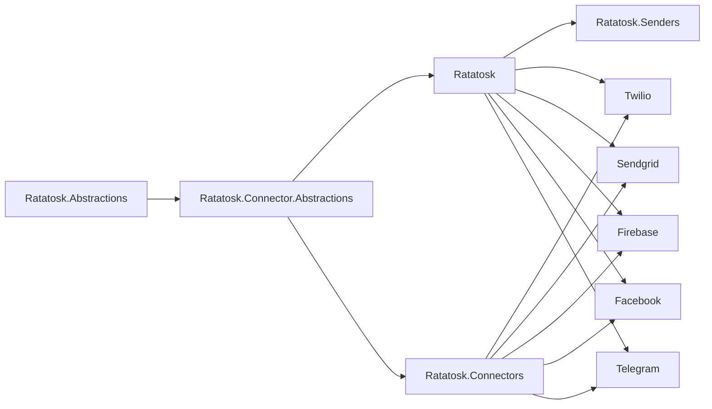

# Ratatosk — Agent Guide

Multi-package .NET messaging framework (SMS, email, push, chat). 12 src packages, 12 test packages, 1 shared test helper.

## Quick commands

```bash
dotnet build Ratatosk.sln                        # build all packages (net8.0;net9.0;net10.0)
dotnet build Ratatosk.sln --framework net10.0     # single TFM
dotnet test Ratatosk.sln                          # all tests, all TFMs
dotnet test test/Ratatosk.XUnit                   # single test project
dotnet test --filter "FullyQualifiedName~MessageBuilder"  # focused test
dotnet test -- --coverage --coverage-output-format cobertura  # collect coverage
```

No explicit lint/typecheck step — `dotnet build` handles compilation with nullable enabled.

## Docusaurus documentation site

```bash
npm --prefix website install      # install dependencies
npm --prefix website run start    # dev server at localhost:3000
npm --prefix website run build    # static build -> website/build/
npm --prefix website run serve    # serve production build locally
```

## Package dependency order



Connectors (Twilio, SendGrid, etc.) depend on both `Ratatosk` and `Ratatosk.Connectors`.

## Key architectural facts

- DI entrypoint: `services.AddMessaging()` returns `MessagingBuilder` (`Ratatosk` package)
- High-level facade: `IMessagingClient` (disposable, lazy-init, named channel routing) in `Ratatosk` package
- All operations return `OperationResult<T>` from `Deveel.Results` (not exceptions)
- `Ratatosk.Testing` project is a shared test utility lib (Bogus fixtures, assertion helpers), NOT a test project
- Connectors reference `Deveel` via `<Using Include="Deveel" />` in project files — code uses `Deveel.OperationResult` etc.
- Test projects auto-import `Xunit` and `Ratatosk` globally via `test/Directory.Build.props`
- Source projects target `net8.0;net9.0;net10.0`; test projects also triple-target

## Testing conventions

- xUnit v3 with Microsoft Testing Platform runner (`UseMicrosoftTestingPlatformRunner=true`)
- Tests are `Exe` output type, projects marked with `<IsTestProject>true</IsTestProject>`
- Test project naming: `Ratatosk.{Package}.XUnit` in `test/` directory
- Fixtures in `test/Ratatosk.XUnit/Fixtures/` — use `MockConnector` for unit tests
- Coverage via `Microsoft.Testing.Extensions.CodeCoverage` (included in test Directory.Build.props)

## Versioning & CI

- GitVersion with `ContinuousDelivery` mode — do NOT edit versions in csproj files
- `main` branch → preview packages (`-alpha.N` suffix)
- `vX.Y.Z` tags → stable NuGet release
- CI runs on ubuntu-latest + windows-latest for .NET 8/9/10; PR builds use same matrix (ubuntu + windows), no coverage
- Old repo URL was `github.com/deveel/deveel.messaging`; current is `deveel/ratatosk`

## Available skills

- `.opencode/skills/xunit-test-arch/` — test project structure
- `.opencode/skills/xunit-test-organization/` — test naming/writing conventions
- `.opencode/skills/custom-framework-arch/` — multi-library framework design
