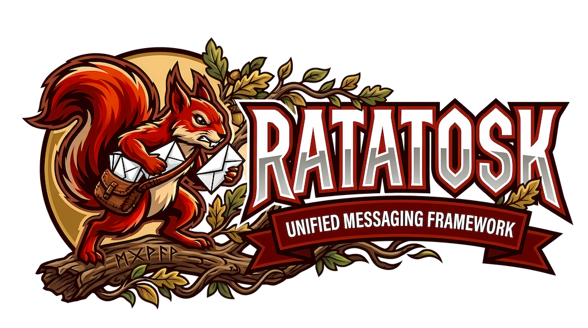

[](https://www.nuget.org/packages/Ratatosk.Abstractions/)
[](https://codecov.io/gh/deveel/deveel.messaging)
[](LICENSE)
[](https://dotnet.microsoft.com/)
[](https://messaging.deveel.org)

<p align="center">
  
</p>

# Ratatosk

> **Note:**
> This project was originally named **Deveel Messaging**: on the day _25.05.2026_ it has been rebranded as **Ratatosk**, after the mythological squirrel that runs up and down Yggdrasil, the World Tree, carrying messages between the eagle at the top and the dragon at the roots — a fitting symbol for a messaging framework.

A .NET framework for multi-channel messaging. It provides a single, provider-agnostic programming model for sending and receiving messages through different channel backends — SMS, email, push notifications, and instant messaging.

The same `Message` object, the same `IChannelConnector` interface, and the same `OperationResult<T>` handling pattern work for Twilio, SendGrid, Firebase, Facebook Messenger, Telegram, and any custom provider you implement.

```csharp
var message = new MessageBuilder()
    .WithId("order-confirm-123")
    .FromPhone("+15550001111")
    .ToPhone("+15550002222")
    .WithText("Your order has been confirmed!")
    .Build();

var result = await connector.SendMessageAsync(message, ct);
```

The `Message` and `connector.SendMessageAsync()` call stay identical regardless of whether the connector is Twilio SMS, SendGrid email, Firebase push, or any other provider. Only the connector type and endpoint types change.

## Motivations

Modern applications need to reach users across multiple channels — SMS for transaction alerts, email for receipts and marketing, push notifications for mobile engagement, and chat apps for conversational support. Each channel has its own SDK, its own message format, its own authentication model, and its own error semantics. Wiring each one independently leads to:

- **Duplicated infrastructure** — every channel reimplements the same patterns: connection lifecycle, retries, logging, credential management, input validation
- **Provider lock-in** — business logic becomes coupled to Twilio's SMS model or SendGrid's email model; switching providers means rewriting
- **Inconsistent developer experience** — each SDK has different conventions, error handling, and configuration models
- **Difficult cross-channel routing** — sending the same notification through SMS and email requires building separate message objects and calling separate APIs

Ratatosk solves these problems by defining a **unified message model** (`IMessage`), a **contract-driven connector interface** (`IChannelConnector`), and a **schema system** (`IChannelSchema`) that lets each connector declare its capabilities and constraints. Business code depends only on the abstractions; channel-specific details are encapsulated behind the connector boundary.

The framework is deliberately focused on the messaging contract and connector consistency. It does not include queueing, scheduling, persistence, or retries — those concerns belong to your application layer, where you can choose the tools that fit your architecture.

## Features

- **Unified message model** — `Message` with fluent builder, dedicated `MessageBuilder`, typed endpoints, and 8 content types (text, HTML, media, binary, JSON, location, template, multipart)
- **Schema-driven validation** — every connector declares its capabilities, parameters, and constraints via `IChannelSchema`; validate messages before they reach the provider
- **Pluggable authentication** — API key, token, basic auth, OAuth 2.0 client credentials, Firebase service account, or custom providers
- **DI-first design** — `AddMessaging()` + `AddConnector<T>()` integration with `Microsoft.Extensions.DependencyInjection`
- **Standardized results** — all operations return `OperationResult<T>` with success/failure semantics
- **Schema derivation** — derive restricted schemas from a master for feature tiers or environment-specific restrictions
- **IMessagingClient facade** — disposable high-level client with lazy initialization and named channel routing; simplifies connector lifecycle
- **Extensible** — implement `ChannelConnectorBase` to add any provider; built-in logging scopes, state management, and error wrapping

## Packages

| Package | Description | NuGet |
|---|---|---|
| `Ratatosk.Abstractions` | Message model with fluent builder, dedicated `MessageBuilder`, typed endpoints, eight content types, properties, and batch support. No external dependencies. | [](https://nuget.org/packages/Ratatosk.Abstractions) |
| `Ratatosk` | DI registration (`AddMessaging`), `IMessagingClient` facade (disposable), connector factory, and service collection extensions. | [](https://nuget.org/packages/Ratatosk) |
| `Ratatosk.Connector.Abstractions` | Contracts for connectors, schemas, authentication, validation, and result types. Reference when building custom connector libraries. | [](https://nuget.org/packages/Ratatosk.Connector.Abstractions) |
| `Ratatosk.Connectors` | Abstract connector base class (`ChannelConnectorBase`) with state management and error wrapping, fluent schema builder (`ChannelSchema`), schema registry, auth manager, and connector builder API. | [](https://nuget.org/packages/Ratatosk.Connectors) |
| `Ratatosk.Twilio` | Twilio SMS, MMS, and WhatsApp messaging with status callbacks and template support. | [](https://nuget.org/packages/Ratatosk.Twilio) |
| `Ratatosk.Sendgrid` | SendGrid transactional and bulk email with HTML, multipart, templates, attachments, and event webhook processing. | [](https://nuget.org/packages/Ratatosk.Sendgrid) |
| `Ratatosk.Firebase` | Firebase Cloud Messaging push notifications for device tokens and topics, with batch sends and dry-run mode. | [](https://nuget.org/packages/Ratatosk.Firebase) |
| `Ratatosk.Facebook` | Facebook Messenger Page-based messaging with text, media, quick replies, and webhook inbound processing. | [](https://nuget.org/packages/Ratatosk.Facebook) |
| `Ratatosk.Telegram` | Telegram bot messaging with rich text, media, locations, and webhook-based update processing. | [](https://nuget.org/packages/Ratatosk.Telegram) |

## Reading path

**New to the framework:**

1. [Framework overview](framework-overview.md) — concepts and building blocks
2. [Installation](installation.md) — package selection and DI wiring
3. [Quickstart](quickstart.md) — send your first message in 5 minutes

**Core concepts:**

- [Message model](messaging-model.md) — Message builder, endpoints, all content types, properties
- [Channel schema](channel-schema.md) — defining connector contracts and validation rules
- [Schema derivation](schema-derivation.md) — creating restricted schemas from master schemas
- [Message validation](message-validation.md) — pre-flight validation before connector calls
- [IMessagingClient facade](quickstart.md#6-imessagingclient-facade) — high-level client with lazy initialization and named channel routing

**Building and wiring:**

- [Connector implementation](connector-implementation.md) — writing custom connectors with `ChannelConnectorBase`
- [Authentication](authentication.md) — auth providers, credential management, OAuth flows
- [Result types](result-types.md) — `OperationResult<T>`, send results, health data
- [Advanced configuration](advanced.md) — security, named connector isolation, health checks, testing

**Connector guides:**

- [Connector index](connectors/README.md) — all supported providers

**Samples:**

- [Samples overview](samples/README.md) — runnable sample applications for each channel
